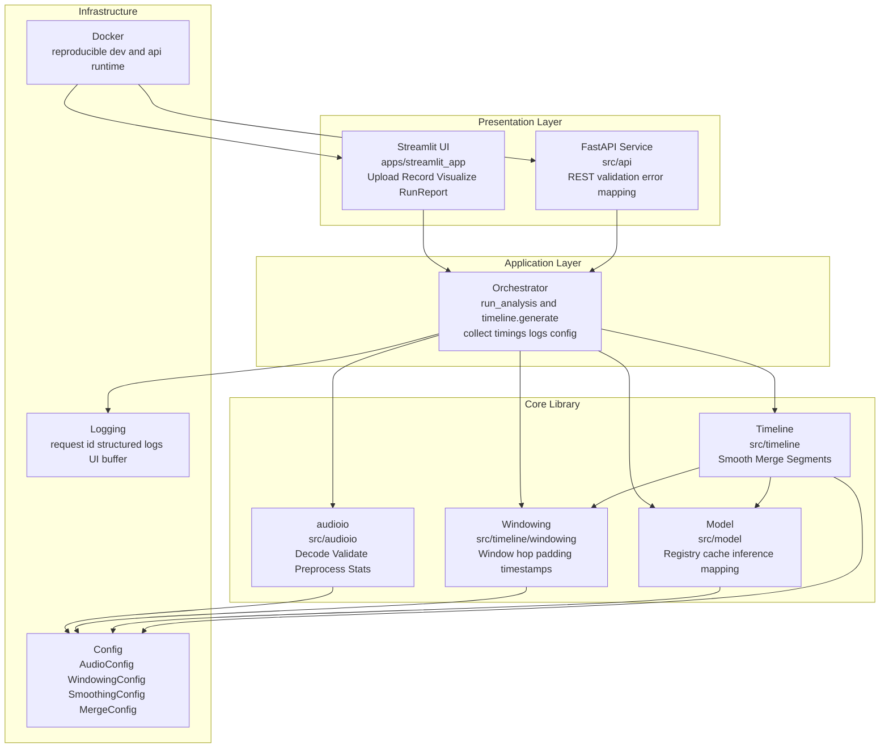
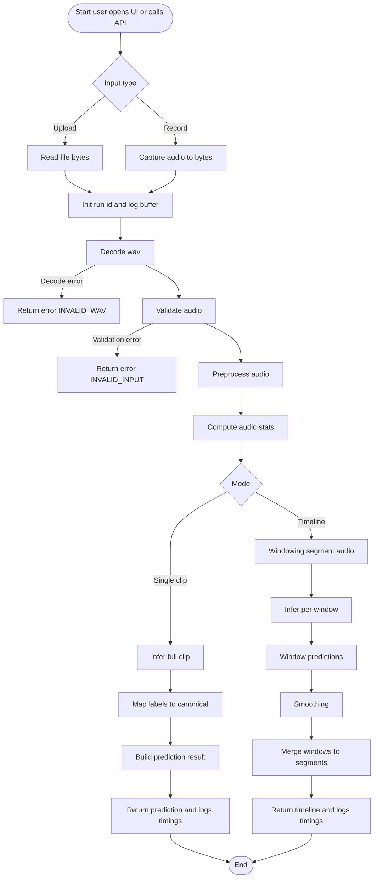
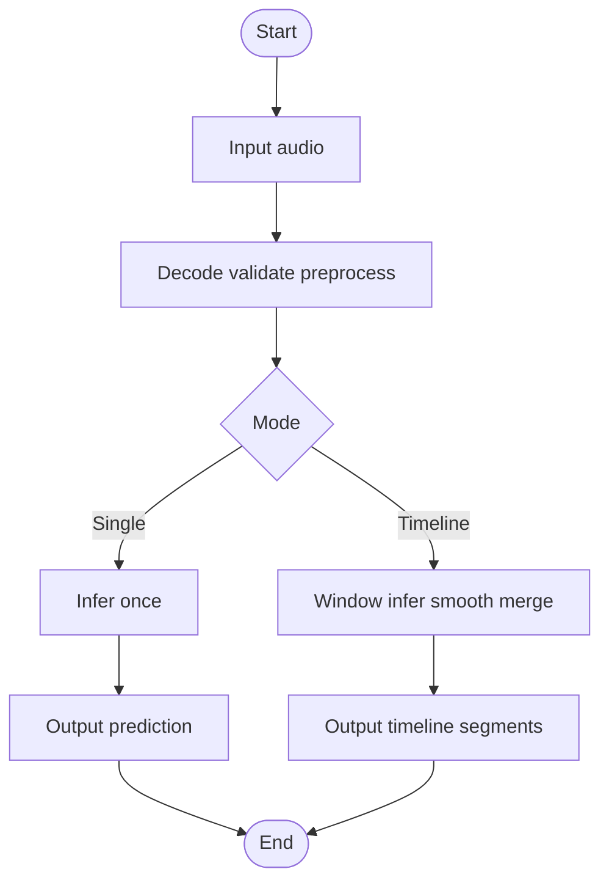
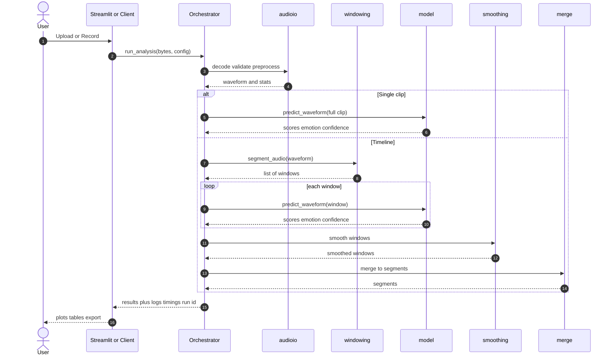

# Speech Emotion Recognition Pipeline Report

**Scope:** Audio emotion analysis pipeline from user input (upload/record) to single-clip prediction or emotion timeline output.  
**Interfaces:** Streamlit UI (debug/monitoring cockpit) and FastAPI service.  
**Core:** Deterministic audio pipeline + windowing + inference + smoothing + segment merging.

---

## 1. System Overview

The system processes speech audio and predicts emotion in two modes:

- **Single-clip mode:** One emotion label and confidence for the entire audio clip.
- **Timeline mode:** Emotion over time computed through sliding windows, smoothing, and segment merging.

Design goals:

- **Reproducibility:** Same input and settings produce the same output.
- **Robustness:** Validation rejects invalid or meaningless input early.
- **Observability:** Logs and step timings are captured and shown in Streamlit (RunReport concept).
- **Modularity:** Core logic is shared between UI and API.

---

## 2. Clean Modular Architecture (Layered)

---

## 3. Activity Diagram (Detailed)

End-to-end activity from input to outputs, including error paths and monitoring.

---

## 4. Activity Diagram (Simplified)

Minimal view for executive summary.

---

## 5. Runtime Sequence Architecture

Runtime interactions between modules.

---

## 6. Configuration Index

### 6.1 Audio validation and preprocessing

| Setting | Meaning | Why it matters |
|---|---|---|
| `target_sample_rate` | Resample all audio to a common sampling rate (e.g., 16000 Hz). | Ensures consistent time scale and model compatibility. |
| `to_mono` | Convert audio to single channel. | Standardizes input and avoids channel imbalance. |
| `normalize` + `peak_target` | Peak normalize amplitude so max abs value approaches target. | Reduces loudness variation and clipping risk. |
| `min_duration_sec` / `max_duration_sec` | Allowed duration range. | Prevents invalid input and runaway compute. |
| `reject_silence` + `silence_rms_threshold` | Reject near-silent audio using RMS energy. | Prevents meaningless predictions and improves reliability. |

### 6.2 Windowing and stride parameters (Timeline mode)

| Setting | Meaning | Practical effect |
|---|---|---|
| `window_sec` | Length of each analysis chunk. | Larger means more context, smoother but less reactive. |
| `hop_sec` (stride) | Step between window starts. | Smaller means higher time resolution but more compute. |
| overlap | Derived as `window_sec - hop_sec`. | More overlap stabilizes but increases compute. |
| `pad_mode` | How to handle end-of-audio windows. | `zero` adds silence, `reflect` avoids silence, `none` gives shorter last window. |
| `include_partial_last_window` | Keep or drop trailing partial window. | Controls coverage of the last seconds. |

### 6.3 Smoothing parameters

| Setting | Meaning | Practical effect |
|---|---|---|
| `method=none` | No stabilization. | Most jitter, fastest. |
| `method=majority`, `majority_window` | Majority vote across neighbor windows. | Strong jitter reduction, can lag transitions. |
| `method=hysteresis`, `hysteresis_min_run` | Switch emotion only after N consistent windows. | Stable and still responsive. |
| `method=ema`, `ema_alpha` | Smooth score probabilities over time. | Smooth confidence curves and transitions. |

### 6.4 Segment merging parameters

| Setting | Meaning | Practical effect |
|---|---|---|
| `merge_adjacent` | Merge consecutive same-emotion windows into one segment. | Produces clean human-readable timeline. |
| `min_segment_sec` | Minimum acceptable segment duration. | Defines what counts as noise. |
| `drop_short_segments` + strategy | Merge tiny segments into neighbors. | Reduces flicker segments in the final timeline. |

---

## 7. Why this pipeline is strong

1. **Deterministic processing:** decoding, resampling, windowing, smoothing are stable and testable.  
2. **Clean modular design:** UI and API reuse the same core library.  
3. **Observability via RunReport:** logs + timings + config snapshot per run.  
4. **Temporal stability controls:** smoothing and merging reduce jitter and improve usability.  
5. **Robust validation:** prevents garbage-in garbage-out.

---

## 8. Recommended defaults

| Category | Defaults |
|---|---|
| Audio | `target_sample_rate=16000`, `to_mono=True`, `normalize=True` |
| Windowing | `window_sec=2.0`, `hop_sec=0.5`, `pad_mode=zero` |
| Smoothing | `method=hysteresis`, `hysteresis_min_run=3` |
| Merge | `merge_adjacent=True`, `min_segment_sec=0.25`, `drop_short_segments=False` |
